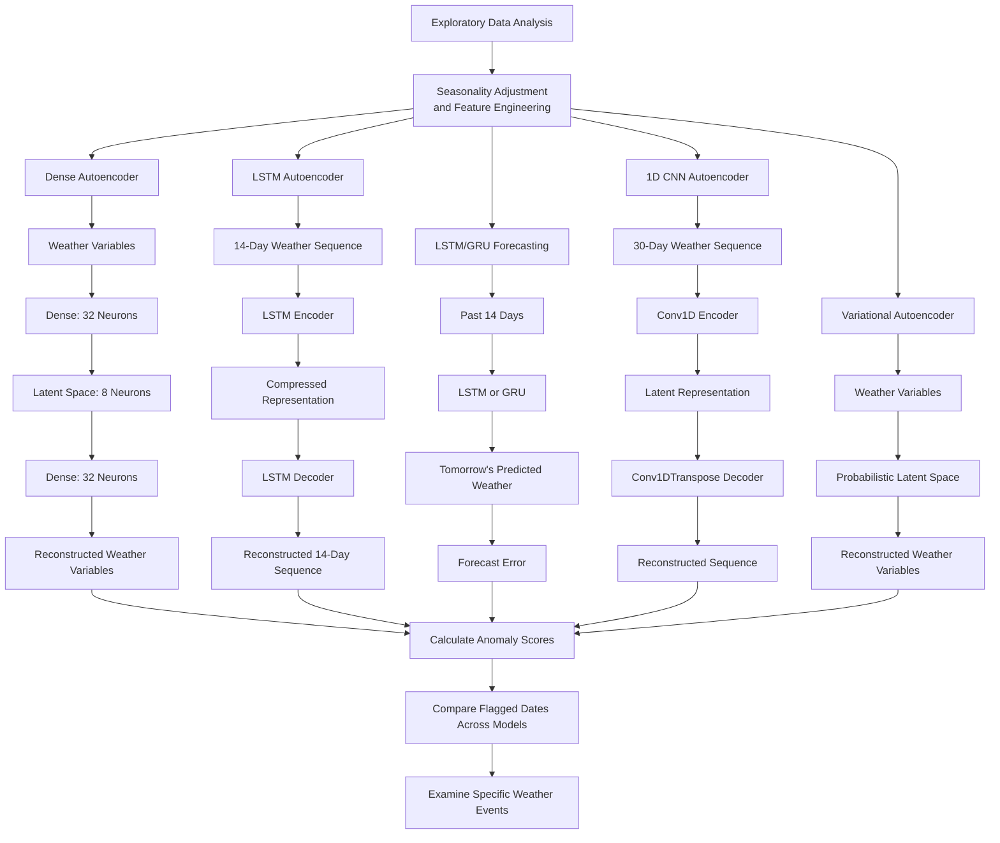

## Anomaly Detection Workflow

```mermaid
flowchart TD
    A["Exploratory Data Analysis"] --> B["Seasonality Adjustment<br/>and Feature Engineering"]

    B --> C["Dense Autoencoder"]
    B --> D["LSTM Autoencoder"]
    B --> E["LSTM/GRU Forecasting"]
    B --> F["1D CNN Autoencoder"]
    B --> G["Variational Autoencoder"]

    C --> C1["Weather Variables"]
    C1 --> C2["Dense: 32 Neurons"]
    C2 --> C3["Latent Space: 8 Neurons"]
    C3 --> C4["Dense: 32 Neurons"]
    C4 --> C5["Reconstructed Weather Variables"]

    D --> D1["14-Day Weather Sequence"]
    D1 --> D2["LSTM Encoder"]
    D2 --> D3["Compressed Representation"]
    D3 --> D4["LSTM Decoder"]
    D4 --> D5["Reconstructed 14-Day Sequence"]

    E --> E1["Past 14 Days"]
    E1 --> E2["LSTM or GRU"]
    E2 --> E3["Tomorrow's Predicted Weather"]
    E3 --> E4["Forecast Error"]

    F --> F1["30-Day Weather Sequence"]
    F1 --> F2["Conv1D Encoder"]
    F2 --> F3["Latent Representation"]
    F3 --> F4["Conv1DTranspose Decoder"]
    F4 --> F5["Reconstructed Sequence"]

    G --> G1["Weather Variables"]
    G1 --> G2["Probabilistic Latent Space"]
    G2 --> G3["Reconstructed Weather Variables"]

    C5 --> H["Calculate Anomaly Scores"]
    D5 --> H
    E4 --> H
    F5 --> H
    G3 --> H

    H --> I["Compare Flagged Dates Across Models"]
    I --> J["Examine Specific Weather Events"]
```

